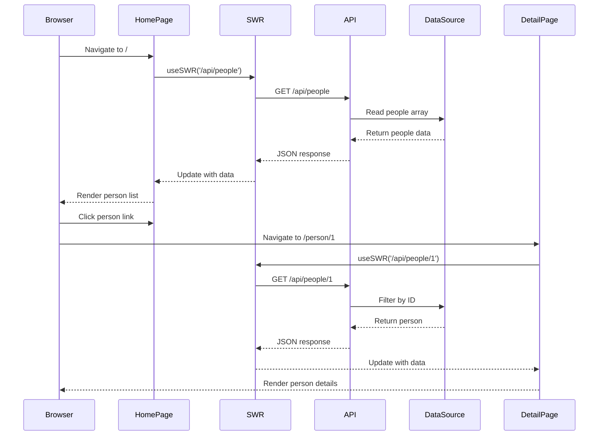

# Nextjs Example

A demonstration project showcasing how to use Next.js API routes together with the React SWR data fetching library to build a simple yet effective full-stack application. This example highlights the power of Next.js serverless functions for creating backend APIs alongside efficient client-side data fetching, caching, and automatic data synchronization with SWR.

Built in November 2020 and later updated to reflect modern Next.js best practices and improved project structure.

## Features

- 📡 **API Routes** - Serverless API endpoints built into Next.js
- 🔄 **SWR Data Fetching** - Efficient stale-while-revalidate caching strategy
- 🎯 **Dynamic Routing** - File-based routing with dynamic parameters
- ⚡ **Server-Side Rendering** - Fast initial page loads with SSR
- 🔗 **Client-Side Navigation** - Smooth transitions without full page reloads
- 💾 **Static Data Source** - In-memory data storage (easily replaceable with database)

### Core Capabilities

- **Next.js API Routes**: Serverless functions for backend logic
- **SWR Data Fetching**: Advanced caching and revalidation
- **Dynamic Routing**: Flexible file-based URL structures
- **Responsive Design**: Mobile-friendly UI components
- **Client-Side Navigation**: Instant page transitions

### Technical Excellence

- **Modern Architecture**: Built with Next.js best practices
- **Performance Optimized**: Automatic code splitting and image optimization
- **Developer-Friendly**: Hot module reloading and fast refresh
- **Scalable Design**: Easily extendable with database and auth integrations
- **Reliable Fetching**: Built-in error handling and loading states

### Developer Experience

- **Zero Configuration**: Start developing immediately with sensible defaults
- **Rich Tooling**: Pre-configured ESLint and Prettier
- **Interactive Debugging**: Built-in error overlays and fast refresh
- **Clear Documentation**: Comprehensive guides for setup and usage
- **Modern Stack**: React, SWR, and Next.js integration

## Getting Started

### Prerequisites

- Node.js (v14 or higher)
- npm or yarn

### Installation

1. Clone the repository:

```bash
git clone https://github.com/orassayag/nextjs-example.git
cd nextjs-example
```

2. Install dependencies:

```bash
npm install
# or
yarn install
```

3. Run the development server:

```bash
npm run dev
# or
yarn dev
```

4. Open [http://localhost:3000](http://localhost:3000) in your browser

## Configuration

### Environment Variables

Create a `.env.local` file in the root directory to customize the application:

```env
# Example environment variables
NEXT_PUBLIC_API_URL=http://localhost:3000/api
# Add other configuration settings here
```

### Next.js Config

The project uses standard Next.js configuration in `next.config.js` (if present) or default settings.

## Usage

### Interactive Exploration

1. Start the development server: `npm run dev`
2. Navigate through the character list on the home page
3. Click on individual characters to see detailed information
4. Observe the automatic data fetching and caching in action

### API Usage

You can access the API endpoints directly:

- List all people: `GET /api/people`
- Get single person: `GET /api/people/:id`

## Project Architecture

```mermaid
graph TD
    A[Browser] -->|HTTP Request| B[Next.js Server]
    B -->|Route: /| C[Home Page]
    B -->|Route: /person/:id| D[Person Detail Page]
    B -->|Route: /api/people| E[People API Handler]
    B -->|Route: /api/people/:id| F[Person API Handler]

    C -->|Fetch Data| E
    D -->|Fetch Data| F

    E -->|Read| G[(data.js)]
    F -->|Read| G

    C -->|Render| H[Person List Component]
    H -->|Link| D

    style A fill:#e1f5ff
    style B fill:#fff4e1
    style G fill:#e8f5e9
    style C fill:#f3e5f5
    style D fill:#f3e5f5
    style E fill:#ffe0b2
    style F fill:#ffe0b2

### Architecture Principles

1. **Separation of Concerns**: API logic is isolated from UI components
2. **Client-Side Data Management**: SWR handles the "source of truth" for remote data
3. **Dynamic Routing**: File-based system for predictable navigation
4. **Performance First**: Optimized rendering strategies (SSR, CSR)
5. **Extensibility**: Modular structure allows for easy feature additions
```

## Data Flow



## Available Scripts

### `npm run dev`

Starts the development server on [http://localhost:3000](http://localhost:3000)

- Hot module reloading enabled
- Error overlay for debugging
- Fast refresh for instant feedback

### `npm run build`

Creates an optimized production build

- Minifies JavaScript and CSS
- Optimizes images and assets
- Generates static pages where possible

### `npm run start`

Runs the production server

- Requires running `npm run build` first
- Optimized for performance
- Production-ready deployment

## API Endpoints

### GET /api/people

Returns all Star Wars characters.

**Response:**

```json
[
  {
    "id": "1",
    "name": "Luke Skywalker",
    "height": "172",
    "mass": "77",
    "hair_color": "blond",
    "skin_color": "fair",
    "eye_color": "blue",
    "gender": "male"
  },
  ...
]
```

### GET /api/people/:id

Returns a specific character by ID.

**Parameters:**

- `id` (string) - Character ID

**Response (Success - 200):**

```json
{
  "id": "1",
  "name": "Luke Skywalker",
  "height": "172",
  "mass": "77",
  "hair_color": "blond",
  "skin_color": "fair",
  "eye_color": "blue",
  "gender": "male"
}
```

**Response (Not Found - 404):**

```json
{
  "message": "User with id: 999 not found."
}
```

## Project Structure

```
nextjs-example/
├── components/
│   └── Person.js          # Reusable person list item component
├── pages/
│   ├── api/               # API routes (serverless functions)
│   │   └── people/
│   │       ├── index.js   # Handler for /api/people
│   │       └── [id].js    # Handler for /api/people/:id
│   ├── person/            # Dynamic person detail pages
│   │   └── [id].js        # Detail page for /person/:id
│   └── index.js           # Home page - list of all people
├── data.js                # Static data source
├── package.json           # Project dependencies and scripts
└── README.md              # This file
```

### Directory Structure

```
nextjs-example/
├── components/         # Reusable UI components
├── pages/              # Routing and page components
│   ├── api/            # Serverless API endpoints
│   ├── person/         # Dynamic detail pages
│   └── index.js        # Entry point / Home page
├── public/             # Static assets (images, icons)
├── styles/             # Global and modular CSS
├── data.js             # Mock data source
└── package.json        # Dependencies and scripts
```

### Design Patterns

- **Custom Hooks**: Encapsulating data fetching logic with SWR
- **Higher-Order Components**: (If applicable) for layout and auth
- **Container/Presenter Pattern**: Separating data logic from UI rendering
- **API Handler Pattern**: Standardized request/response handling in routes

## Key Concepts

### 1. API Routes

Next.js allows you to create API endpoints as Node.js functions inside the `pages/api` directory. Each file exports a handler function that receives request and response objects.

**Example:**

```javascript
export default function handler(req, res) {
  res.status(200).json({ message: 'Hello World' });
}
```

### 2. Dynamic Routes

Files and folders with `[param]` syntax create dynamic routes that match any path segment.

**Example:**

- `pages/person/[id].js` matches `/person/1`, `/person/2`, etc.
- Access the parameter via `useRouter().query.id`

### 3. SWR (Stale-While-Revalidate)

SWR is a React hooks library for data fetching with built-in caching and revalidation.

**Benefits:**

- Fast page loads with cached data
- Automatic revalidation in the background
- Built-in loading and error states
- Request deduplication

**Example:**

```javascript
const { data, error } = useSWR('/api/people', fetcher);
```

### 4. Client-Side Navigation

The Next.js Link component enables client-side navigation without full page reloads.

**Example:**

```javascript
<Link href='/person/[id]' as={`/person/${person.id}`}>
  <a>{person.name}</a>
</Link>
```

## Extending the Application

### Add Database Integration

Replace the static data source with a real database:

```javascript
// pages/api/people/index.js
import { query } from '../../lib/db';

export default async function handler(req, res) {
  const people = await query('SELECT * FROM people');
  res.status(200).json(people);
}
```

### Add Authentication

Protect API routes with authentication middleware:

```javascript
import { withAuth } from '../../lib/auth';

export default withAuth(async function handler(req, res) {
  // Protected endpoint
});
```

### Add Validation

Validate request parameters:

```javascript
export default function handler(req, res) {
  const { id } = req.query;

  if (!id || isNaN(id)) {
    return res.status(400).json({ message: 'Invalid ID' });
  }

  // Process request
}
```

### Add More Data Sources

Integrate external APIs:

```javascript
export default async function handler(req, res) {
  const response = await fetch('https://api.example.com/data');
  const data = await response.json();
  res.status(200).json(data);
}
```

## Deployment

### Deploy with Vercel (Recommended)

Vercel is the company behind Next.js and provides the best hosting experience:

[](https://vercel.com/import/project?template=https://github.com/orassayag/nextjs-example)

**Steps:**

1. Push your code to GitHub
2. Import the project into Vercel
3. Deploy with zero configuration

### Deploy to Other Platforms

For other hosting providers:

1. Build the project: `npm run build`
2. Upload the entire project directory
3. Run `npm start` on the server

## Learn More

- [Next.js Documentation](https://nextjs.org/docs) - Learn about Next.js features and API
- [SWR Documentation](https://swr.vercel.app) - Learn about SWR data fetching
- [React Documentation](https://react.dev) - Learn React fundamentals
- [Next.js GitHub](https://github.com/vercel/next.js) - Explore the source code

## Contributing

Contributions to this project are [released](https://help.github.com/articles/github-terms-of-service/#6-contributions-under-repository-license) to the public under the [project's open source license](LICENSE).

Everyone is welcome to contribute. Contributing doesn't just mean submitting pull requests—there are many different ways to get involved, including answering questions and reporting issues.

Please feel free to contact me with any question, comment, pull-request, issue, or any other thing you have in mind.

## Best Practices

1. **Component Modularization**: Keep components small and focused
2. **SWR Usage**: Use the custom fetcher pattern for consistency
3. **API Route Security**: Implement validation and error handling in all routes
4. **Data Management**: Keep the static data source clean and formatted
5. **SEO Optimization**: Use Next.js Head component for page-specific metadata

## Development

### Code Quality

**Format code:**

```bash
npm run format # If configured
```

**Lint code:**

```bash
npm run lint
```

### Testing

**Run tests:**

```bash
npm test # If configured
```

### Building

**Create production build:**

```bash
npm run build
```

**Start production server:**

```bash
npm run start
```

## Support

For questions, issues, or contributions:

- **GitHub Issues**: [https://github.com/orassayag/nextjs-example/issues](https://github.com/orassayag/nextjs-example/issues)
- **Email**: orassayag@gmail.com

## Author

- **Or Assayag** - _Initial work_ - [orassayag](https://github.com/orassayag)
- Or Assayag <orassayag@gmail.com>
- GitHub: https://github.com/orassayag
- StackOverflow: https://stackoverflow.com/users/4442606/or-assayag?tab=profile
- LinkedIn: https://linkedin.com/in/orassayag

## License

This application has an MIT license - see the [LICENSE](LICENSE) file for details.

## Acknowledgments

- Built for educational and research purposes
- Respects robots.txt and implements rate limiting
- Uses user-agent rotation to avoid detection
- Implements polite crawling practices
