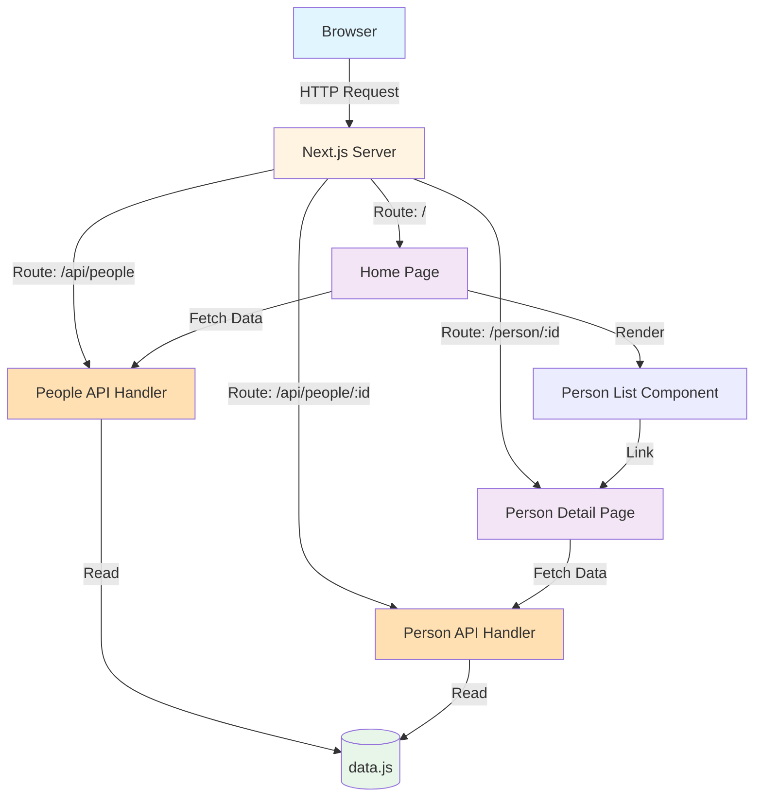
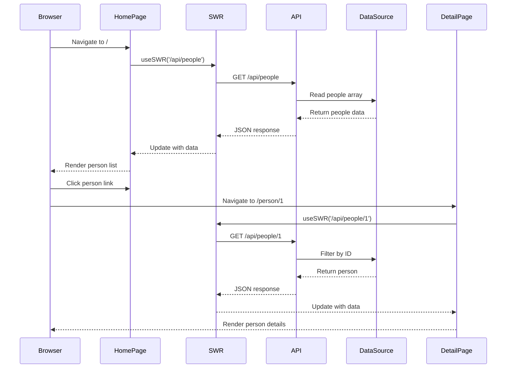

# Next.js API Routes Example

A demonstration of Next.js API routes and React SWR data fetching library. This example shows how to build a simple full-stack application using Next.js serverless functions and efficient client-side data fetching.

Built in November 2020. Updated for modern Next.js best practices.

## Features

- 📡 **API Routes** - Serverless API endpoints built into Next.js
- 🔄 **SWR Data Fetching** - Efficient stale-while-revalidate caching strategy
- 🎯 **Dynamic Routing** - File-based routing with dynamic parameters
- ⚡ **Server-Side Rendering** - Fast initial page loads with SSR
- 🔗 **Client-Side Navigation** - Smooth transitions without full page reloads
- 💾 **Static Data Source** - In-memory data storage (easily replaceable with database)

## Getting Started

### Prerequisites

- Node.js (v14 or higher)
- npm or yarn

### Installation

1. Clone the repository:
```bash
git clone https://github.com/orassayag/nextjs-example.git
cd nextjs-example
```

2. Install dependencies:
```bash
npm install
# or
yarn install
```

3. Run the development server:
```bash
npm run dev
# or
yarn dev
```

4. Open [http://localhost:3000](http://localhost:3000) in your browser

## Project Architecture



## Data Flow



## Available Scripts

### `npm run dev`
Starts the development server on [http://localhost:3000](http://localhost:3000)
- Hot module reloading enabled
- Error overlay for debugging
- Fast refresh for instant feedback

### `npm run build`
Creates an optimized production build
- Minifies JavaScript and CSS
- Optimizes images and assets
- Generates static pages where possible

### `npm run start`
Runs the production server
- Requires running `npm run build` first
- Optimized for performance
- Production-ready deployment

## API Endpoints

### GET /api/people
Returns all Star Wars characters.

**Response:**
```json
[
  {
    "id": "1",
    "name": "Luke Skywalker",
    "height": "172",
    "mass": "77",
    "hair_color": "blond",
    "skin_color": "fair",
    "eye_color": "blue",
    "gender": "male"
  },
  ...
]
```

### GET /api/people/:id
Returns a specific character by ID.

**Parameters:**
- `id` (string) - Character ID

**Response (Success - 200):**
```json
{
  "id": "1",
  "name": "Luke Skywalker",
  "height": "172",
  "mass": "77",
  "hair_color": "blond",
  "skin_color": "fair",
  "eye_color": "blue",
  "gender": "male"
}
```

**Response (Not Found - 404):**
```json
{
  "message": "User with id: 999 not found."
}
```

## Project Structure

```
nextjs-example/
├── components/
│   └── Person.js          # Reusable person list item component
├── pages/
│   ├── api/               # API routes (serverless functions)
│   │   └── people/
│   │       ├── index.js   # Handler for /api/people
│   │       └── [id].js    # Handler for /api/people/:id
│   ├── person/            # Dynamic person detail pages
│   │   └── [id].js        # Detail page for /person/:id
│   └── index.js           # Home page - list of all people
├── data.js                # Static data source
├── package.json           # Project dependencies and scripts
└── README.md              # This file
```

## Key Concepts

### 1. API Routes
Next.js allows you to create API endpoints as Node.js functions inside the `pages/api` directory. Each file exports a handler function that receives request and response objects.

**Example:**
```javascript
export default function handler(req, res) {
  res.status(200).json({ message: 'Hello World' })
}
```

### 2. Dynamic Routes
Files and folders with `[param]` syntax create dynamic routes that match any path segment.

**Example:**
- `pages/person/[id].js` matches `/person/1`, `/person/2`, etc.
- Access the parameter via `useRouter().query.id`

### 3. SWR (Stale-While-Revalidate)
SWR is a React hooks library for data fetching with built-in caching and revalidation.

**Benefits:**
- Fast page loads with cached data
- Automatic revalidation in the background
- Built-in loading and error states
- Request deduplication

**Example:**
```javascript
const { data, error } = useSWR('/api/people', fetcher)
```

### 4. Client-Side Navigation
The Next.js Link component enables client-side navigation without full page reloads.

**Example:**
```javascript
<Link href="/person/[id]" as={`/person/${person.id}`}>
  <a>{person.name}</a>
</Link>
```

## Extending the Application

### Add Database Integration
Replace the static data source with a real database:

```javascript
// pages/api/people/index.js
import { query } from '../../lib/db'

export default async function handler(req, res) {
  const people = await query('SELECT * FROM people')
  res.status(200).json(people)
}
```

### Add Authentication
Protect API routes with authentication middleware:

```javascript
import { withAuth } from '../../lib/auth'

export default withAuth(async function handler(req, res) {
  // Protected endpoint
})
```

### Add Validation
Validate request parameters:

```javascript
export default function handler(req, res) {
  const { id } = req.query
  
  if (!id || isNaN(id)) {
    return res.status(400).json({ message: 'Invalid ID' })
  }
  
  // Process request
}
```

### Add More Data Sources
Integrate external APIs:

```javascript
export default async function handler(req, res) {
  const response = await fetch('https://api.example.com/data')
  const data = await response.json()
  res.status(200).json(data)
}
```

## Deployment

### Deploy with Vercel (Recommended)
Vercel is the company behind Next.js and provides the best hosting experience:

[](https://vercel.com/import/project?template=https://github.com/orassayag/nextjs-example)

**Steps:**
1. Push your code to GitHub
2. Import the project into Vercel
3. Deploy with zero configuration

### Deploy to Other Platforms
For other hosting providers:
1. Build the project: `npm run build`
2. Upload the entire project directory
3. Run `npm start` on the server

## Learn More

- [Next.js Documentation](https://nextjs.org/docs) - Learn about Next.js features and API
- [SWR Documentation](https://swr.vercel.app) - Learn about SWR data fetching
- [React Documentation](https://react.dev) - Learn React fundamentals
- [Next.js GitHub](https://github.com/vercel/next.js) - Explore the source code

## Contributing

Contributions to this project are [released](https://help.github.com/articles/github-terms-of-service/#6-contributions-under-repository-license) to the public under the [project's open source license](LICENSE).

Everyone is welcome to contribute. Contributing doesn't just mean submitting pull requests—there are many different ways to get involved, including answering questions and reporting issues.

Please feel free to contact me with any question, comment, pull-request, issue, or any other thing you have in mind.

## Author

* **Or Assayag** - *Initial work* - [orassayag](https://github.com/orassayag)
* Or Assayag <orassayag@gmail.com>
* GitHub: https://github.com/orassayag
* StackOverflow: https://stackoverflow.com/users/4442606/or-assayag?tab=profile
* LinkedIn: https://linkedin.com/in/orassayag

## License

This project is licensed under the MIT License - see the [LICENSE](LICENSE) file for details.
